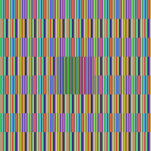
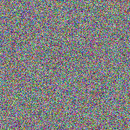

# Cryptography exercise — why ECB mode leaks structure — 2026-09-04

## Topic

Why AES in ECB (Electronic Codebook) mode is unsafe for anything beyond a single 16-byte block, demonstrated visually rather than just stated.

## What I worked through

Built a 256×256 patterned bitmap (horizontal bands plus a solid black square in the middle — chosen specifically so large runs of pixels repeat every 16 bytes, matching the AES block size) and encrypted the raw pixel bytes two ways with the same random 128-bit key: once in ECB mode, once in CBC mode with a random IV. Then reinterpreted each ciphertext as raw pixel data and saved it back out as an image.

```python
from PIL import Image
from cryptography.hazmat.primitives.ciphers import Cipher, algorithms, modes
import os

raw = img.tobytes()  # 256*256*3 = 196,608 bytes = 12,288 AES blocks

key = os.urandom(16)

# ECB
enc = Cipher(algorithms.AES(key), modes.ECB()).encryptor()
ecb_ct = enc.update(raw) + enc.finalize()

# CBC, random IV
iv = os.urandom(16)
enc2 = Cipher(algorithms.AES(key), modes.CBC(iv)).encryptor()
cbc_ct = enc2.update(raw) + enc2.finalize()
```

Block-level evidence, counting duplicate 16-byte ciphertext blocks:

```
ECB total blocks: 12288   unique blocks: 5      duplicate ratio: 100.0%
CBC total blocks: 12288   unique blocks: 12288   duplicate ratio: 0.0%
```

Every one of the 12,288 ECB blocks collapses into just 5 distinct ciphertext values, because the plaintext only had 5 distinct 16-byte patterns to begin with (two band colors, the black square, and the two edges where they meet). CBC produces a unique ciphertext block every single time, even though it's encrypting the exact same plaintext with the exact same key.

**Plaintext** — visible bands and a black square:


**ECB ciphertext** — same structure clearly visible, just recolored:



**CBC ciphertext** — indistinguishable from noise:



## The failure mode, precisely

ECB encrypts each 16-byte block independently with the same key, so identical plaintext blocks always produce identical ciphertext blocks — deterministic, with no dependency on position or on any other block. The cipher itself (AES) isn't broken; the *mode* throws away the one property that makes block cipher output look random: that identical inputs shouldn't produce identical, correlatable outputs. CBC's random IV plus its per-block chaining (each ciphertext block feeds into the encryption of the next plaintext block) is what removes that correlation.

## What I got wrong first

I expected the leak to be subtle — a statistical artifact you'd need a chi-squared test to notice. It isn't. The black square in the middle of the source image is trivially visible in the ECB ciphertext, at full contrast, with zero analysis required. That's the actual lesson: ECB doesn't degrade security a little, it removes the point of encrypting structured data at all.

## Where this shows up in the real world

The canonical real case is Adobe's 2013 breach: encrypted customer passwords (not hashed — encrypted with 3DES, and in ECB mode) leaked in a form where identical passwords produced identical ciphertext blocks. Security researchers were able to cluster accounts with matching passwords and, combined with Adobe's stored (also breached) password hints, guess large numbers of them outright — without ever breaking the underlying cipher. It's the exact mechanism demonstrated above: ECB doesn't need to be "cracked" to leak information, it leaks by design the moment the input has any repeated structure, and passwords across a large user base repeat constantly.
